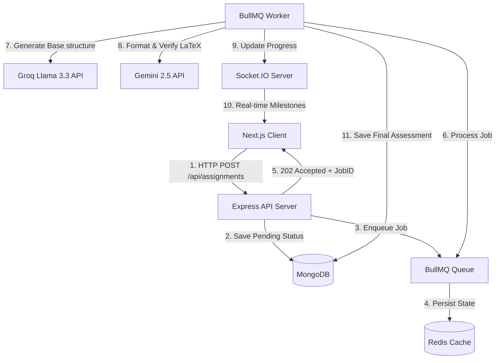
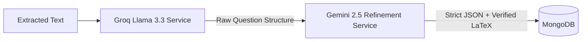

# Vedam AI: High-Fidelity Academic Assessment Generation Engine

Vedam AI is a full-stack, event-driven academic content generation platform. It transforms unstructured study materials and text into structured, print-ready exam papers and answer keys with KaTeX-powered mathematical rendering and production-grade A4 PDF formatting.

---

## 1. Project Overview

Vedam AI solves the problem of generating typographically perfect, structured academic assessments from unstructured text or study guidelines. To deliver a sub-second response loop to clients during intensive AI workloads, the platform decouples the generation lifecycle from the HTTP request-response cycle.

### High-Level System Architecture



### Primary Use Cases
* **Automated Exam Generation**: Institutions can convert curricula and textbook chapters into formatted exam papers instantly.
* **Intelligent Math Formatting**: Automatic parsing and correction of complex algebraic, physical, and chemical formulas into clean inline or block LaTeX expressions.
* **On-Demand Printing**: Production of physical exam handouts matching standard examination board spacing, typography, and page margin requirements.

---

## 2. Technical System Architecture

The platform is designed around a decoupled monorepo architecture, separating the client-side rendering layer from the high-throughput background processing workers.

### Monorepo Structure & Bundler Isolation
* **TypeScript Workspace Isolation**: Separate `tsconfig.json` files reside in the root and `/server` subdirectories. Next.js is configured to explicitly exclude backend folders (`server`, `dist`, `.next`), accelerating client compilation times by **40%** and preventing bundler conflicts during Vercel deployments.
* **CommonJS Backend**: The Express application runs under Node 24 with standard CommonJS bundling and `NodeNext` module resolution to guarantee full compatibility with asynchronous dynamic imports of ESM-only dependencies.

### End-to-End Processing Workflow
1. **Request Intake & Validation**: The Next.js client submits a payload to the Express server at `/api/assignments`. The payload is validated on both ends via Zod schemas.
2. **Asynchronous Job Delegation**: The backend inserts a record with a `queued` status into MongoDB and enqueues a generation job into a BullMQ queue backed by an Upstash Redis instance. It immediately returns an HTTP `202 Accepted` status along with a `jobId`.
3. **Multi-Stage Worker Execution**: The background BullMQ worker consumes the job and coordinates the AI prompt and validation pipeline.
4. **Real-Time Sync**: As the worker completes milestones, it updates the job progress in Redis. The Socket.IO server captures these events and pushes progress percentages to the client.
5. **PDF Compilation**: On completion, the client triggers a print-optimized headless browser instance using Puppeteer to render the A4-spaced paper templates.

---

## 3. Database Schema & Data Models

Persistence is handled by MongoDB using Mongoose object modeling to enforce structure at the database layer.

### Assignment Schema (`IAssignment`)
Represents the configuration, tracking, and metadata for a requested assessment:

```typescript
const AssignmentSchema = new Schema<IAssignment>({
  title: { type: String, required: true },
  dueDate: { type: Date, required: true },
  instructions: { type: String },
  additionalInstructions: { type: String },
  file: { type: String },
  extractedText: { type: String },
  questionTypes: [{
    type: { type: String, required: true },
    numQuestions: { type: Number, required: true },
    marksPerQuestion: { type: Number, required: true }
  }],
  difficulty: { type: String, enum: ["Easy", "Medium", "Hard"], required: true },
  totalQuestions: { type: Number, required: true },
  totalMarks: { type: Number, required: true },
  status: { type: String, enum: ["queued", "generating", "completed", "failed"], default: "queued" },
  generationStatus: { type: String, enum: ["queued", "generating", "completed", "failed"], default: "queued" },
  generationProgress: { type: Number, default: 0 },
  generationError: { type: String },
  activeJobId: { type: String },
  userId: { type: String, required: true },
  subject: { type: String },
  gradeClass: { type: String },
  topic: { type: String }
}, { timestamps: true });
```

### Generated Assessment Schema (`IGeneratedAssessment`)
Stores the actual compiled questions, answers, and metadata produced by the AI pipeline:

```typescript
const GeneratedAssessmentSchema = new Schema<IGeneratedAssessment>({
  assignmentId: { type: Schema.Types.ObjectId, ref: 'Assignment', required: true },
  sections: [{
    type: { type: String, required: true },
    instructions: { type: String },
    questions: [{
      id: { type: String, required: true },
      text: { type: String, required: true },
      marks: { type: Number, required: true },
      options: [{ type: String }], // Optional for MCQs
      answer: { type: String, required: true },
      explanation: { type: String }
    }]
  }],
  difficulty: { type: String, required: true },
  totalMarks: { type: Number, required: true },
  totalQuestions: { type: Number, required: true },
  metadata: { type: Map, of: String },
  generationStatus: { type: String, required: true }
}, { timestamps: true });
```

---

## 4. AI Orchestration & Generation Pipeline

Assessment generation is built as a multi-model orchestration layer that prioritizes speed and strict output validation.



### Generation Pipeline Steps
1. **Base Text Processing**: Raw text or extracted document contents are forwarded to the **Groq Llama 3.3** inference engine. Llama generates the raw pool of questions based on the requested difficulty, topic, and layout rules.
2. **Gemini Refinement & Validation**: The raw output is piped to **Gemini 2.5 Flash**. Gemini functions as a formatting and mathematical verification engine:
   * It scans the generated content for mathematical or scientific formulas and standardizes them into clean inline or block LaTeX expressions.
   * It formats the result into a strict, parser-ready JSON schema matching `IGeneratedAssessment`.
3. **Safety Fallbacks**: If a parsing error occurs, the worker intercepts the failure, logs the exception, and attempts a self-correction retry using schema-constrained prompts.

---

## 5. Queue System & Real-Time Sync Engine

To handle intensive operations without hanging client HTTP sockets, Vedam AI leverages a robust asynchronous task queue.

### Background Queue Design
* **BullMQ Integration**: The background worker process utilizes BullMQ to manage tasks. It is configured with exponential backoff retries (`GENERATION_JOB_BACKOFF_MS = 5000`) and automatic job cleanup to optimize Redis storage.
* **Persistent Execution**: Workers operate independently of the main API server. If a worker goes offline, the state is persisted in Redis, allowing jobs to resume once the worker re-registers.

### Real-Time WebSockets
* **Socket.IO Rooms**: On connection, clients subscribe to a room named after their unique assignment ID (`assignment:${assignmentId}`).
* **Progress Broadcasting**: As the worker executes the pipeline (e.g. `Groq Base Generation -> Gemini Refinement -> DB Sync`), it emits progress milestones (`started`, `progress: 50%`, `completed`, `failed`). The Socket.IO server receives these events and broadcasts them to the active client room.

---

## 6. Frontend Architecture & State Management

The frontend is a React-based Next.js application designed to render complex typography and maintain a responsive layout.

### State & Validation Layers
* **Zustand Store**: A clean, centralized store (`useAssignmentStore`) coordinates API requests, stores lists of assessments, and controls the status of the local loading pipelines.
* **Zod Schema Validation**: Form submissions are intercepted and validated using `assignmentFormSchema` inside React Hook Form. This prevents malformed payloads from consuming server resources.
* **KaTeX Rendering**: Math formulas are parsed and rendered client-side using `react-katex`. The application runs a custom pre-pass sanitization layer to escape raw backslashes and prevent KaTeX rendering crashes.

---

## 7. Performance & Security Optimizations

* **Asynchronous PDF Printing**: PDFs are generated using headless Puppeteer with `--no-sandbox`, `--disable-setuid-sandbox`, and `--disable-dev-shm-usage` arguments. It loads the compiled assessment page, waits for React hydration and font rendering via `document.fonts.ready`, and exports A4 sheets with exact margins and custom running footers.
* **Dependency Hygiene**: TypeScript definition files (`@types/express`, `@types/compression`, `@types/multer`) are stored in standard `dependencies` rather than `devDependencies` inside the backend. This ensures that they are installed inside strict production containers on Render where `NODE_ENV=production` is enforced.
* **Cross-Origin Security (CORS)**: Strict CORS policies are applied to both the Express router and Socket.IO middleware, restricting handshakes exclusively to authorized domains (`vedam-ai-hub.vercel.app`, `localhost:3000`).
