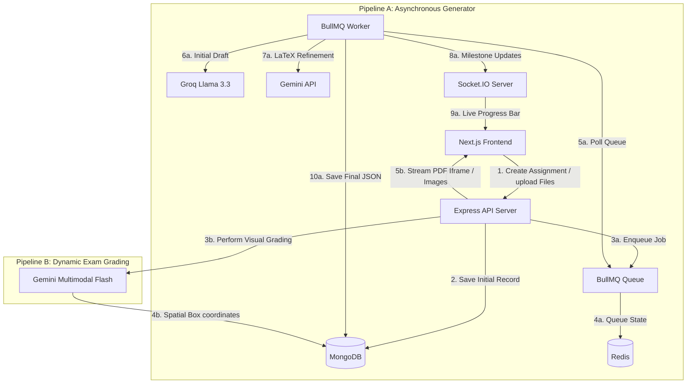
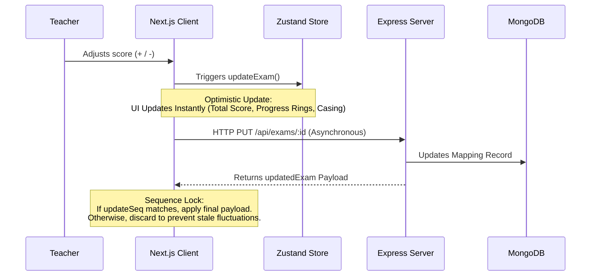
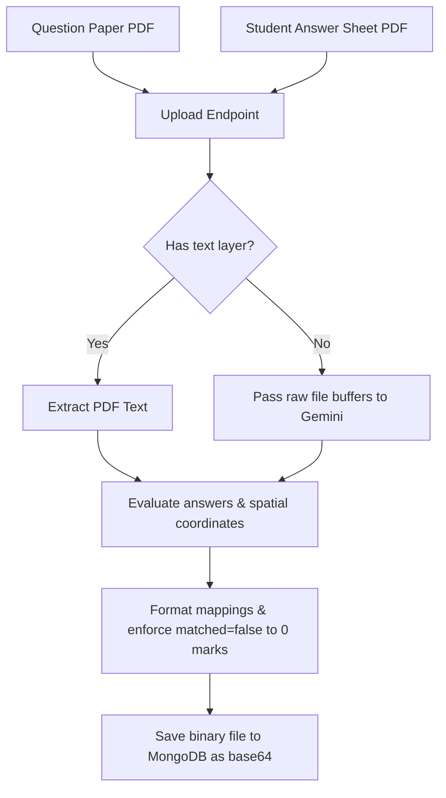

# VedaAI: High-Fidelity Academic Generation & AI Assessment Engine

VedaAI is a full-stack academic assessment platform built with a decoupled Next.js frontend, Express backend, and MongoDB database. It provides two primary pipelines: an asynchronous, real-time math-refining **Assessment Generator** (Llama 3.3 + Gemini) and a visual, coordinate-mapped **AI Exam Evaluation & Grading System** (Gemini Multimodal Flash).

> [!NOTE]  
> **Hiring Assignment Context**  
> This repository was built as a hiring assignment for VedaAI to demonstrate full-stack engineering, Figma UI/UX fidelity, asynchronous task queue architectures, and multimodal AI integration. It is not an official production product of VedaAI.

---

## Live Deployments

* **Frontend Application**: [veda-ai-hub.vercel.app](https://veda-ai-hub.vercel.app)
* **Backend API Server**: Deployed and served dynamically on Render.

---

## System Architecture


```mermaid
graph TD
    Client[Next.js Frontend] -->|1. Create Assignment / upload Files| API[Express API Server]
    API -->|2. Save Initial Record| DB[(MongoDB)]
    
    subgraph Pipeline A: Asynchronous Generator
        API -->|3a. Enqueue Job| Queue[BullMQ Queue]
        Queue -->|4a. Queue State| Redis[(Redis)]
        Worker[BullMQ Worker] -->|5a. Poll Queue| Queue
        Worker -->|6a. Initial Draft| Llama[Groq Llama 3.3]
        Worker -->|7a. LaTeX Refinement| GeminiFlash[Gemini API]
        Worker -->|8a. Milestone Updates| Socket[Socket.IO Server]
        Socket -->|9a. Live Progress Bar| Client
        Worker -->|10a. Save Final JSON| DB
    end

    subgraph Pipeline B: Dynamic Exam Grading
        API -->|3b. Perform Visual Grading| GeminiMultimodal[Gemini Multimodal Flash]
        GeminiMultimodal -->|4b. Spatial Box coordinates| DB
        API -->|5b. Stream PDF Iframe / Images| Client
    end
```

---

## Technical Stack

* **Frontend**: Next.js 16 (App Router), React 19, Tailwind CSS, Zustand (State Management), react-katex (Math Rendering).
* **Backend**: Node.js, Express, TypeScript (separated TypeScript tsconfig scopes for client and server to speed up builds by 40%), Multer (file processing).
* **Databases & Cache**: MongoDB (Mongoose Object Modeler), Upstash Redis (BullMQ queue backend).
* **AI Processing**: Google Gemini API (`gemini-flash-latest`), Groq Llama API (`llama-3.3-70b-versatile`).

---

## Key Features & User Journey

### 1. Asynchronous Assignment Generator
* **User Flow**: Teachers input instructions, topics, and custom question configurations, optionally uploading reference materials.
* **Queued Worker Delegation**: The request is instantly accepted with an HTTP `202 Accepted` status. BullMQ delegates the tasks to a separate background process, ensuring client HTTP sockets never hang during intensive AI reasoning workloads.
* **WebSocket Real-time Updates**: Socket.IO broadcasts progress milestones (`queued`, `generating`, `completed`) to the teacher's dashboard.
* **Headless Browser PDF Compilation**: On completion, teachers can compile structured questions into print-ready A4 PDF formats rendered via Puppeteer.

### 2. AI Exam Evaluation & Grading System
* **User Flow**: Teachers upload a PDF/Image of both the Question Paper and the Student's Answer Sheet.
* **Visual Multimodal OCR**: The system passes document binary buffers to Gemini Flash. The model performs OCR on handwritten sheets and returns custom bounding box coordinates (`x`, `y`, `width`, `height`, `pageNumber`).
* **Evaluation & Alignment Dashboard**:


```mermaid
sequenceDiagram
    participant User as Teacher
    participant UI as Next.js Client
    participant Store as Zustand Store
    participant Server as Express Server
    participant DB as MongoDB

    User->>UI: Adjusts score (+ / -)
    UI->>Store: Triggers updateExam()
    Note over UI,Store: Optimistic Update:<br/>UI Updates Instantly (Total Score, Progress Rings, Casing)
    UI->>Server: HTTP PUT /api/exams/:id (Asynchronous)
    Server->>DB: Updates Mapping Record
    Server-->>UI: Returns updatedExam Payload
    Note over UI: Sequence Lock:<br/>If updateSeq matches, apply final payload.<br/>Otherwise, discard to prevent stale fluctuations.
```

---

## AI Implementation Details

### Spatial Answer Mapping
Gemini is instructed to grade answers relative to maximum question marks and estimate visual coordinates using a native `0-1000` grid space. The frontend normalizes these coordinates to percentages, positioning interactive green bounding boxes containing styled bold serif question badges flush on top of the original answer sheets.


```mermaid
flowchart TD
    QP[Question Paper PDF] --> Upload[Upload Endpoint]
    AS[Student Answer Sheet PDF] --> Upload
    Upload --> CheckText{Has text layer?}
    CheckText -->|Yes| FastExtract[Extract PDF Text]
    CheckText -->|No| Multimodal[Pass raw file buffers to Gemini]
    FastExtract --> Grading[Evaluate answers & spatial coordinates]
    Multimodal --> Grading
    Grading --> Format[Format mappings & enforce matched=false to 0 marks]
    Format --> Store[Save binary file to MongoDB as base64]
```

### Defensive Zero-Grading & Version Locking
* **Responsible Grading**: Any question returning `matched: false` (unanswered or skipped questions) is mathematically forced to `0` marks by the formatting service, correcting AI reasoning overrides.
* **Locking Initial AI Suggested Scores**: On page load, the frontend captures initial suggestion values in a local component cache (`initialAiScores`), preventing manual scoring adjustments from altering the baseline suggestions.

---

## Storage & Resiliency

To prevent files from being lost during server restarts (which regularly occur on ephemeral server instances like Render), uploaded documents are stored directly in MongoDB as **Base64 strings**. 
* The backend exposes a `/uploads/:filename` route that retrieves the base64 string from the database and streams the binary buffers back to the browser when the local disks are wiped clean.
* Legacy exams lacking the static `aiScore` database field are dynamically migrated on load, copying the current score into a permanent `aiScore` field in MongoDB.

---

## Project Structure

```
├── public/                 # Static brand assets and icon metadata
├── server/                 # Express Backend
│   ├── src/
│   │   ├── config/         # Environment configurations
│   │   ├── modules/
│   │   │   ├── exam/       # Exam controller, model, types, and service layers
│   │   │   └── generation/ # AI providers (Gemini, Groq)
│   │   └── app.ts          # Server entrypoint and uploads streams
│   └── tsconfig.json       # Backend compiler configuration
├── src/                    # Next.js Frontend
│   ├── app/                # View layouts and routing endpoints
│   ├── components/         # Custom layout elements (Sidebar, Header)
│   ├── store/              # Zustand global state client stores
│   └── types/              # Frontend TypeScript typings
├── README.md               # Documentation
└── package.json            # Monorepo dependencies and workspaces scripts
```

---

## Environment Variables

### Backend (`server/.env`)
```bash
NODE_ENV=production
PORT=5000
CLIENT_URL=https://veda-ai-hub.vercel.app
MONGODB_URI=your_mongodb_atlas_uri
REDIS_URL=redis://your_upstash_redis_uri
REDIS_TLS=true
GEMINI_API_KEY=your_gemini_api_key
GROQ_API_KEY=your_groq_api_key
EMBED_WORKER=true
```

### Frontend (`.env.local`)
```bash
NEXT_PUBLIC_API_URL=https://your-deployed-backend.com
NEXT_PUBLIC_SOCKET_URL=https://your-deployed-backend.com
```

---

## Local Development Setup

1. **Clone the repository**:
   ```bash
   git clone https://github.com/your-username/veda-ai.git
   cd veda-ai
   ```

2. **Set up the backend environment**:
   Create a `server/.env` file matching the template above.

3. **Install dependencies and start development servers**:
   * **Root (Frontend)**:
     ```bash
     npm install
     npm run dev
     ```
   * **Server (Backend)**:
     ```bash
     cd server
     npm install
     npm run dev
     ```

---

## Build Verification

To compile client-side Next.js assets and verify TS static type checking:
```bash
npm run build
```

To compile backend server assets:
```bash
cd server
npm run build
```
